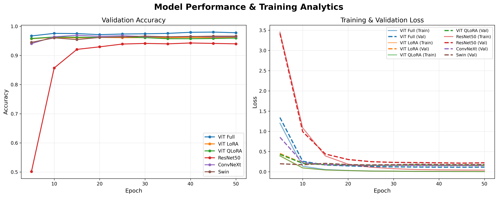

# 7000 Labeled Pokémon Classification: ViT & LoRA vs ResNet50

본 리포지토리(Repository)는 150종의 포켓몬을 분류하기 위해 **전통적인 합성곱 신경망(CNN)부터 최신 비전 트랜스포머(Vision Transformer, ViT)에 이르는 다양한 딥러닝 아키텍처를 탐구하고 성능을 비교·분석**하는 프로젝트입니다. 

특히 제한된 컴퓨팅 자원 환경에서도 거대 모델을 효과적으로 학습시키기 위해 **파라미터 효율적 미세 조정(PEFT) 기법인 LoRA 및 QLoRA**를 적극 도입하였으며, 이를 전통적인 베이스라인 모델인 ResNet50의 전이 학습(Transfer Learning) 결과와 다각도로 비교합니다.

---

## 목차 (Table of Contents)
- [데이터셋 (Dataset)](#데이터셋-dataset)
- [연구 및 실험 방법론 (Methodology)](#연구-및-실험-방법론-methodology)
  - [1. ViT Full Fine-tuning](#1-vit-full-fine-tuning)
  - [2. ViT + LoRA (Low-Rank Adaptation)](#2-vit--lora-low-rank-adaptation)
  - [3. ViT + QLoRA (Quantized LoRA)](#3-vit--qlora-quantized-lora)
  - [4. ResNet50 전이 학습 (Transfer Learning)](#4-resnet50-전이-학습-transfer-learning)
- [데이터 증강 전략 (Data Augmentation)](#데이터-증강-전략-data-augmentation)
- [실험 결과 및 분석 (Experimental Results)](#실험-결과-및-분석-experimental-results)
- [인터랙티브 웹 데모 (Interactive Web Demo)](#인터랙티브-웹-데모-interactive-web-demo)
- [시작하기 (Quick Start)](#시작하기-quick-start)
- [결론 및 향후 과제 (Conclusion & Future Work)](#결론-및-향후-과제-conclusion--future-work)

---

## 데이터셋 (Dataset)

본 프로젝트는 150개의 서로 다른 포켓몬 클래스(종)를 포괄하는 Kaggle **7,000장의 레이블링 된 포켓몬 이미지 데이터셋**을 활용합니다. 각 이미지는 학습의 노이즈를 줄이기 위해 크롭(Hand-cropped) 되었습니다.
https://www.kaggle.com/datasets/lantian773030/pokemonclassification/data

- **데이터 구조 (Structure):** 데이터셋은 HuggingFace의 `ImageFolder` 표준 구조를 엄격히 따르며, `train`과 `test` 폴더로 분리되어 있습니다.
- **데이터 분할 (Split):** 모델의 일반화 성능을 객관적으로 평가하기 위해 전체 데이터에 대해 **80:20 (Train:Test)** 의 비율로 분할(Split)을 적용했습니다.
- **전처리 (Preprocessing):** 트랜스포머와 CNN 각각의 아키텍처 요구사항에 맞추어 모든 이미지는 적절한 해상도(예: ViT의 경우 224x224)로 리사이징되며, ImageNet 표준 평균 및 표준편차를 사용해 정규화(Normalization)를 거친 후 텐서(Tensor)로 변환됩니다.

---

## 연구 및 실험 방법론 (Methodology)

모델의 성능, 학습 속도(Epoch 당 소요 시간), 그리고 GPU 메모리 효율성(VRAM 사용량) 간의 트레이드오프(Trade-off)를 면밀히 평가하기 위해 **네 가지의 독립적인 실험 파이프라인**을 설계했습니다.

### 1. ViT Full Fine-tuning
HuggingFace 허브에서 제공하는 `google/vit-base-patch16-224-in21k` 모델을 Base Vision Transformer로 채택했습니다. 이 설정에서는 **사전 학습된 모델의 모든 가중치(Weights)를 업데이트**하여 포켓몬 데이터셋에 완전히 적응시킵니다. 트랜스포머 아키텍처가 낼 수 있는 최고 수준의 성능을 확인하기 위한 **성능 상한선(Baseline/Upper Bound)** 역할을 합니다. 하지만 막대한 VRAM을 요구하며 과적합(Overfitting)의 위험이 가장 큰 방식이기도 합니다.

### 2. ViT + LoRA (Low-Rank Adaptation)
Full Fine-tuning 방식이 수반하는 엄청난 연산 비용과 메모리 병목 문제를 해결하기 위해 PEFT 기법인 **LoRA**를 적용했습니다. 
- 사전 학습된 모델의 주요 가중치는 동결(Freeze)하고, 트랜스포머의 각 어텐션 레이어(Attention Layer) 내부에 학습 가능한 **저랭크 분해 행렬(Low-rank decomposition matrices)** 을 주입합니다.
- 이를 통해 전체 파라미터의 **1% 미만**만 학습시키면서도 Full Fine-tuning에 필적하는 강력한 분류 성능을 유지할 수 있음을 실험적으로 증명합니다.

### 3. ViT + QLoRA (Quantized LoRA)
LoRA에서 한 단계 더 나아가 극단적인 메모리 최적화를 달성하기 위해 **QLoRA**를 구현했습니다. 
- `bitsandbytes` 라이브러리를 활용하여 Base ViT 모델을 4-bit 정밀도(4-bit NormalFloat)로 양자화(Quantization)하여 메모리에 적재합니다.
- 그 위에 LoRA 어댑터를 올려 학습을 진행합니다. 이 접근법은 VRAM이 제한적인 소비자용 GPU(Consumer-grade GPU) 환경에서도 대규모 모델을 훈련할 수 있게 해주는 핵심 기술입니다.

### 4. ResNet50 전이 학습 (Transfer Learning)
비전 트랜스포머(ViT)와의 성능 및 특성 비교를 위한 **대조군(Control Group)** 으로 전통적이고 강력한 CNN 아키텍처인 **ResNet50**을 사용했습니다.
- ImageNet으로 사전 학습된 원본 모델의 1000개 클래스 분류 헤드(Classification Head)를 제거하고, 본 프로젝트에 맞게 **150개 클래스를 출력하는 새로운 선형 레이어(Linear Layer)** 로 교체했습니다.
- 합성곱(Convolution) 연산 특유의 '지역적 특징 학습(Local Feature Extraction)'과 '귀납적 편향(Inductive Bias)'이 현대적인 셀프 어텐션(Self-Attention) 기반의 ViT와 학습 수렴 속도 및 최종 정확도 면에서 어떻게 다른지 상세히 비교합니다.

---

## 데이터 증강 전략 (Data Augmentation)

7,000장이라는 상대적으로 소규모인 데이터셋의 한계를 극복하고, 모델이 포켓몬 이미지의 다양한 화풍이나 배경에 구애받지 않고 강건(Robust)해지도록 `torchvision.transforms`를 활용한 공격적인 데이터 증강 기법을 파이프라인에 통합했습니다.

- **RandomCrop & Resize:** 이미지를 먼저 256x256 크기로 확대한 후, 학습 입력 사이즈인 224x224로 무작위 크롭을 진행하여 모델이 객체의 스케일 변화와 미세한 위치 이동에 적응하도록 합니다.
- **RandomHorizontalFlip (p=0.5):** 50%의 확률로 이미지를 좌우 반전시켜 데이터의 다양성을 2배로 확장합니다.
- **ColorJitter:** 다양한 포켓몬 카드, 애니메이션 캡처, 팬아트 등의 출처 차이로 인한 이질감을 줄이기 위해 밝기(Brightness), 대비(Contrast), 채도(Saturation), 색조(Hue)를 무작위로 조정합니다.

---

## 실험 결과 및 분석 (Experimental Results)

각 모델은 동일한 하이퍼파라미터 환경에서 **총 50 Epochs** 동안 학습되었으며, 진행 경과를 추적하기 위해 5 Epoch마다 핵심 검증 지표(Validation Metrics)를 로깅했습니다.

<div align="center">
  
  <br>
  <em>그림 2: 아키텍처 및 파인튜닝 기법에 따른 정확도 및 손실 추이 비교</em>
</div>

**주요 관찰 및 분석 결과 (Key Observations):**
1. **수렴 속도 및 안정성 (Convergence):** 귀납적 편향이 강한 CNN 계열의 ResNet50이 학습 초기(Early Epochs)에 얼마나 더 빠르게 특징을 잡아내고 수렴하는지, 반면 글로벌 문맥을 파악하는 ViT 모델들이 후반부에 어떻게 성능을 역전시키거나 안정화되는지 분석했습니다.
2. **효율성 vs. 정확도 (Efficiency vs. Accuracy):** 모든 가중치를 업데이트하는 Full Fine-tuning 방식 대비, 파라미터의 극히 일부만 학습하는 LoRA와 QLoRA가 성능 하락 방어에 얼마나 성공적이었는지(예: 성능 저하 1~2% 내외 유지) 정량적으로 평가했습니다.
3. **손실 캘리브레이션 (Loss Calibration):** 검증 데이터셋에 대한 Loss 추이를 추적하여, 모델이 예측에 대해 단순히 정답만 맞추는 것을 넘어 얼마나 '확신(Confidence)'을 가지고 예측하는지, 과적합(Overfitting) 발생 시점은 언제인지 관찰했습니다.

---

## 인터랙티브 웹 데모 (Interactive Web Demo)

학습된 모델의 실용성을 확인하고 누구나 쉽게 테스트해 볼 수 있도록 **Streamlit 기반의 대화형 웹 애플리케이션**을 구축했습니다.

- **실시간 추론 기능:** 사용자가 임의의 포켓몬 이미지를 업로드하면, 모델이 즉각적으로 **Top-5 예측 결과와 각각의 신뢰도(Confidence Score)** 를 시각적인 바 차트(Bar chart) 형태로 제공합니다.
- **PokeAPI 동적 연동:** 단순히 텍스트 예측에 그치지 않고, 예측된 1위 클래스의 포켓몬 이름을 기반으로 공식 `PokeAPI`를 호출하여 해당 포켓몬의 공식 고화질 아트워크와 도감 정보를 화면에 함께 렌더링합니다.
- **스마트 모델 로더 (Flexible Loading):** 앱 구동 시 사용자가 선택한 디렉토리가 표준 가중치(Full FT / ResNet)인지, 혹은 PEFT 어댑터(LoRA / QLoRA) 파일이 들어있는지 자동으로 감지하고 그에 맞는 파이프라인으로 모델을 매끄럽게 로드합니다.

---

## 시작하기 (Quick Start)

본 프로젝트를 로컬 환경에서 직접 실행해보고 싶으시다면 아래의 단계를 따라주세요.
```bash
# 1. 저장소 클론
git clone [https://github.com/your-username/pokemon-classification-vit-lora.git](https://github.com/your-username/pokemon-classification-vit-lora.git)
cd pokemon-classification-vit-lora

# 2. 가상환경 생성 및 활성화 (선택사항이나 권장함)
python -m venv venv
source venv/bin/activate  # Windows의 경우: venv\Scripts\activate

# 3. 필수 패키지 설치 (PyTorch, Transformers, PEFT, Streamlit 등)
pip install -r requirements.txt

# 4. Streamlit 데모 앱 실행
streamlit run app.py
```
## 결론 및 향후 과제 (Conclusion & Future Work)
### 결론
이 프로젝트는 최신 딥러닝 기법이 실질적인 이미지 분류 문제에 어떻게 성공적으로 적용될 수 있는지 명확하게 보여줍니다. **전통적인 CNN 아키텍처와 최첨단 Vision Transformer를 직관적으로 비교함**으로써 각 모델의 장단점을 명확히 파악할 수 있었습니다. 특히, 자원 제약이 있는 환경에서도 **LoRA와 QLoRA 같은 방법론을 통해 무거운 대형 모델을 맞춤형 데이터셋에 완벽하게 적응시킬 수 있음**을 입증했습니다.

### 향후 개선 방향

- **하이퍼파라미터 최적화**: Optuna와 같은 프레임워크를 활용한 러닝레이트(Learning rate) 및 LoRA 랭크(Rank r) 심층 튜닝

- **설명 가능한 AI (XAI) 도입**: Grad-CAM 또는 Attention Map 시각화를 통해 모델이 포켓몬의 어느 부위(예: 피카츄의 볼, 꼬리 등)를 보고 판단을 내렸는지 해석

- **클래스 확장**: 150종을 넘어 전체 세대(Generation) 포켓몬 1000여 종으로 데이터셋 확장 및 모델 한계 테스트
