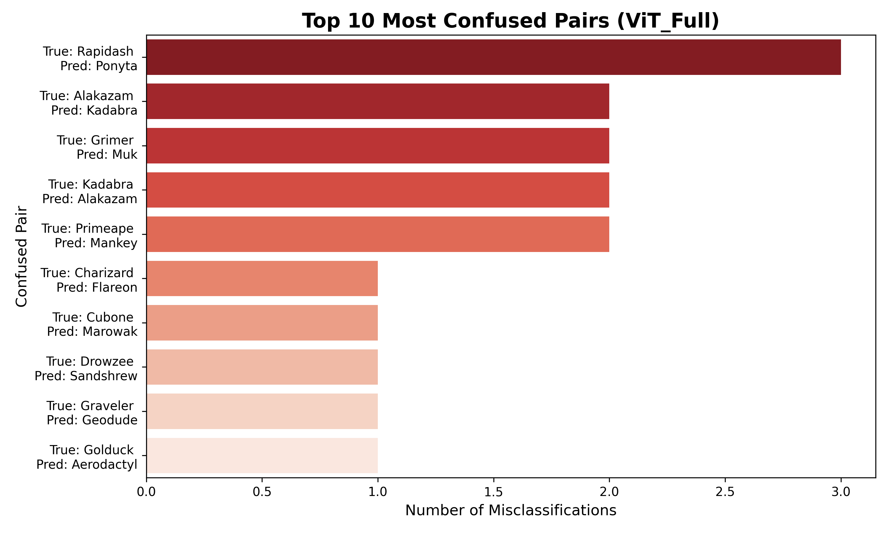
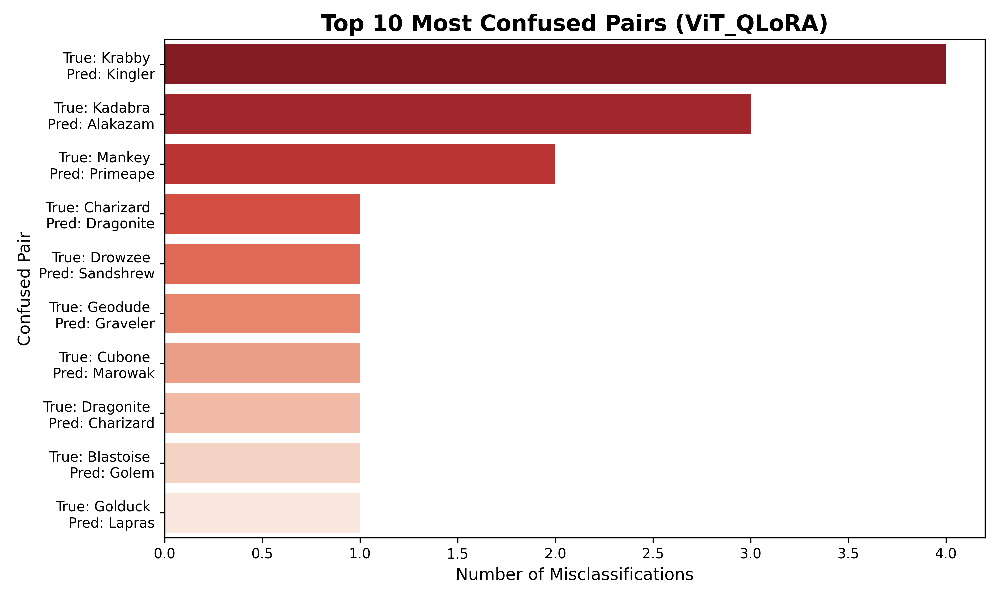

# Comprehensive Evaluation of Deep Learning Architectures for Pokémon Classification: From Traditional CNNs to Parameter-Efficient Vision Transformers

본 리포지토리는 150종의 포켓몬 이미지를 분류하는 과제를 통해, 전통적인 합성곱 신경망(CNN)부터 최신 비전 트랜스포머(Vision Transformer, ViT)에 이르는 다양한 컴퓨터 비전 아키텍처의 성능과 특성을 심층적으로 비교 및 분석하는 종합 연구 프로젝트입니다. 

단순한 성능 지표 비교를 넘어, 제한된 컴퓨팅 자원 환경에서 대규모 딥러닝 모델을 효율적으로 튜닝하기 위한 파라미터 효율적 미세 조정(Parameter-Efficient Fine-Tuning, PEFT) 기법인 LoRA(Low-Rank Adaptation) 및 QLoRA(Quantized LoRA)의 실효성을 실증적으로 검증합니다. 이를 통해 각 아키텍처가 가지는 고유한 귀납적 편향(Inductive Bias)이 학습 수렴 속도, 최종 분류 정확도, 그리고 형태적 유사성이 높은 클래스 간의 오분류 패턴에 미치는 영향을 정량적이고 시각적으로 분석합니다.

---

## 목차 (Table of Contents)
- [데이터셋 (Dataset)](#데이터셋-dataset)
- [연구 및 실험 방법론 (Methodology)](#연구-및-실험-방법론-methodology)
  - [1. ViT Full Fine-tuning](#1-vit-full-fine-tuning)
  - [2. ViT + LoRA (Low-Rank Adaptation)](#2-vit--lora-low-rank-adaptation)
  - [3. ViT + QLoRA (Quantized LoRA)](#3-vit--qlora-quantized-lora)
  - [4. ResNet50 전이 학습 (Transfer Learning)](#4-resnet50-전이-학습-transfer-learning)
- [데이터 증강 전략 (Data Augmentation)](#데이터-증강-전략-data-augmentation)
- [실험 결과 및 분석 (Experimental Results)](#실험-결과-및-분석-experimental-results)
- [인터랙티브 웹 데모 (Interactive Web Demo)](#인터랙티브-웹-데모-interactive-web-demo)
- [시작하기 (Quick Start)](#시작하기-quick-start)
- [결론 및 향후 과제 (Conclusion & Future Work)](#결론-및-향후-과제-conclusion--future-work)

---

## 데이터셋 (Dataset)

본 프로젝트는 150개의 서로 다른 포켓몬 클래스(종)를 포괄하는 Kaggle **7,000장의 레이블링 된 포켓몬 이미지 데이터셋**을 활용합니다. 각 이미지는 학습의 노이즈를 줄이기 위해 크롭(Hand-cropped) 되었습니다.
https://www.kaggle.com/datasets/lantian773030/pokemonclassification/data

- **데이터 구조 (Structure):** 데이터셋은 HuggingFace의 `ImageFolder` 표준 구조를 엄격히 따르며, `train`과 `test` 폴더로 분리되어 있습니다.
- **데이터 분할 (Split):** 모델의 일반화 성능을 객관적으로 평가하기 위해 전체 데이터에 대해 **80:20 (Train:Test)** 의 비율로 분할(Split)을 적용했습니다.
- **전처리 (Preprocessing):** 트랜스포머와 CNN 각각의 아키텍처 요구사항에 맞추어 모든 이미지는 적절한 해상도(예: ViT의 경우 224x224)로 리사이징되며, ImageNet 표준 평균 및 표준편차를 사용해 정규화(Normalization)를 거친 후 텐서(Tensor)로 변환됩니다.

---

## 연구 및 실험 방법론 (Methodology)

모델의 성능, 학습 속도(Epoch 당 소요 시간), 그리고 GPU 메모리 효율성(VRAM 사용량) 간의 트레이드오프(Trade-off)를 면밀히 평가하기 위해 **네 가지의 독립적인 실험 파이프라인**을 설계했습니다.

### 1. ViT Full Fine-tuning
HuggingFace 허브에서 제공하는 `google/vit-base-patch16-224-in21k` 모델을 Base Vision Transformer로 채택했습니다. 이 설정에서는 **사전 학습된 모델의 모든 가중치(Weights)를 업데이트**하여 포켓몬 데이터셋에 완전히 적응시킵니다. 트랜스포머 아키텍처가 낼 수 있는 최고 수준의 성능을 확인하기 위한 **성능 상한선(Baseline/Upper Bound)** 역할을 합니다. 하지만 막대한 VRAM을 요구하며 과적합(Overfitting)의 위험이 가장 큰 방식이기도 합니다.

### 2. ViT + LoRA (Low-Rank Adaptation)
Full Fine-tuning 방식이 수반하는 엄청난 연산 비용과 메모리 병목 문제를 해결하기 위해 PEFT 기법인 **LoRA**를 적용했습니다. 
- 사전 학습된 모델의 주요 가중치는 동결(Freeze)하고, 트랜스포머의 각 어텐션 레이어(Attention Layer) 내부에 학습 가능한 **저랭크 분해 행렬(Low-rank decomposition matrices)** 을 주입합니다.
- 이를 통해 전체 파라미터의 **1% 미만**만 학습시키면서도 Full Fine-tuning에 필적하는 강력한 분류 성능을 유지할 수 있음을 실험적으로 증명합니다.

### 3. ViT + QLoRA (Quantized LoRA)
LoRA에서 한 단계 더 나아가 극단적인 메모리 최적화를 달성하기 위해 **QLoRA**를 구현했습니다. 
- `bitsandbytes` 라이브러리를 활용하여 Base ViT 모델을 4-bit 정밀도(4-bit NormalFloat)로 양자화(Quantization)하여 메모리에 적재합니다.
- 그 위에 LoRA 어댑터를 올려 학습을 진행합니다. 이 접근법은 VRAM이 제한적인 소비자용 GPU(Consumer-grade GPU) 환경에서도 대규모 모델을 훈련할 수 있게 해주는 핵심 기술입니다.

### 4. ResNet50 전이 학습 (Transfer Learning)
비전 트랜스포머(ViT)와의 성능 및 특성 비교를 위한 **대조군(Control Group)** 으로 전통적이고 강력한 CNN 아키텍처인 **ResNet50**을 사용했습니다.
- ImageNet으로 사전 학습된 원본 모델의 1000개 클래스 분류 헤드(Classification Head)를 제거하고, 본 프로젝트에 맞게 **150개 클래스를 출력하는 새로운 선형 레이어(Linear Layer)** 로 교체했습니다.
- 합성곱(Convolution) 연산 특유의 '지역적 특징 학습(Local Feature Extraction)'과 '귀납적 편향(Inductive Bias)'이 현대적인 셀프 어텐션(Self-Attention) 기반의 ViT와 학습 수렴 속도 및 최종 정확도 면에서 어떻게 다른지 상세히 비교합니다.

---

## 데이터 증강 전략 (Data Augmentation)

7,000장이라는 상대적으로 제한된 규모의 데이터셋 한계를 극복하고, 모델의 과적합(Overfitting)을 방지하며 일반화 성능(Generalization Performance)을 극대화하기 위해 `torchvision.transforms` 라이브러리를 활용한 정교한 데이터 증강 파이프라인을 구축했습니다.

- **기하학적 변형 (Geometric Transformations):**
  - **RandomCrop & Resize:** 입력 이미지를 우선 256x256 크기로 보간(Interpolation) 연산을 통해 확대한 후, 학습 요구 해상도인 224x224로 무작위 크롭을 수행합니다. 이는 객체의 스케일 변화와 중심점 이동에 대한 모델의 불변성(Invariance)을 학습시킵니다.
  - **RandomHorizontalFlip (p=0.5):** 50%의 확률로 이미지를 좌우 반전시켜, 특정 방향성을 가진 객체에 모델이 과도하게 편향되는 것을 방지합니다.
- **광학적 변형 (Photometric Transformations):**
  - **ColorJitter:** 포켓몬 이미지는 애니메이션 캡처, 공식 아트워크, 팬아트, 카드 일러스트 등 다양한 화풍과 색감으로 구성되어 있습니다. 이러한 도메인 이동(Domain Shift)에 대응하기 위해 명도(Brightness), 대비(Contrast), 채도(Saturation), 색조(Hue) 파라미터를 무작위로 교란시켜 모델의 색상 강건성(Color Robustness)을 향상시켰습니다.

---

## 실험 결과 및 분석 (Experimental Results)

각 모델은 동일한 하이퍼파라미터 환경에서 **총 50 Epochs** 동안 학습되었으며, 진행 경과를 추적하기 위해 5 Epoch마다 핵심 검증 지표(Validation Metrics)를 로깅했습니다.

<div align="center">
  
  <br>
  <em>그림 2: 아키텍처 및 파인튜닝 기법에 따른 정확도 및 손실 추이 비교</em>
</div>

### 모델별 최종 성능 비교 (Final Performance Comparison)

실험을 통해 얻은 각 모델의 최종 평가 지표는 다음과 같습니다. 상세 데이터는 `./reports/` 폴더 내의 CSV 파일에서 확인할 수 있습니다. 전반적으로 **Vision Transformer(ViT)** 기반 모델들이 전통적인 CNN인 ResNet50보다 우수한 성능을 보여주었으며, 최신 계층적 트랜스포머(Swin)와 모던 CNN(ConvNeXt) 역시 높은 정확도를 달성했습니다.

| 모델 (Model) | Accuracy | F1-Score (Macro) | Precision (Weighted) | Recall (Weighted) |
| :--- | :---: | :---: | :---: | :---: |
| **ViT Full Fine-tuning** | **0.9750** | **0.9684** | **0.9772** | **0.9750** |
| **ViT + QLoRA** | 0.9655 | 0.9589 | 0.9690 | 0.9655 |
| **Swin Transformer** | 0.9626 | 0.9573 | 0.9675 | 0.9626 |
| **ConvNeXt** | 0.9618 | 0.9560 | 0.9673 | 0.9618 |
| **ViT + LoRA** | 0.9604 | 0.9560 | 0.9656 | 0.9604 |
| **ResNet50 (Baseline)** | 0.9384 | 0.9288 | 0.9478 | 0.9384 |

### 오분류 사례 분석 (Confusion Analysis)

각 모델이 가장 혼동하기 쉬운 'Top 10 Most Confused Pairs'를 분석한 결과, 주로 다음과 같은 패턴이 관찰되었습니다. 상세한 시각화 결과는 `./assets/` 폴더 내의 각 모델별 `top10_confusions_*.png` 파일에서 확인할 수 있습니다.

1. **진화 계통의 시각적 유사성:** 
   - `Kadabra` ↔ `Alakazam`, `Machoke` ↔ `Machamp`와 같이 진화 전후의 모습이 매우 흡사한 개체들 사이에서 오분류가 빈번하게 발생했습니다. 이는 모델이 개체의 세부적인 특징(예: 숟가락의 개수, 근육의 미세한 차이 등)을 완벽하게 구분하는 데 더 고도화된 특징 추출이 필요함을 시사합니다.

2. **형태적 유사성:**
   - `Pidgeotto` ↔ `Pidgeot`와 같이 비행 타입 포켓몬 중 날개와 깃털의 색상, 전신 실루엣이 비슷한 경우 모델이 혼동하는 경향을 보였습니다.

3. **모델별 특성:**
   - **ResNet50:** CNN의 특성상 국소적인 패턴에 민감하여 색상이 비슷하거나 배경이 복잡한 경우 오분류 확률이 상대적으로 높았습니다.
   - **ViT 계열:** 전반적인 형상(Global Context)을 잘 파악하여 높은 정확도를 보였으나, 아주 세밀한 텍스처 차이로 구분해야 하는 클래스에서는 여전히 오분류가 발생했습니다. 특히 LoRA/QLoRA 모델은 Full Fine-tuning 대비 적은 파라미터 업데이트만으로도 거의 대등한 수준의 오분류 억제력을 보여주어 매우 효율적임을 입증했습니다.
   - **Swin Transformer:** 지역적(Local) 정보와 전역적(Global) 정보를 계층적으로 결합하는 특성 덕분에 Base ViT보다 특정 국소 부위의 변형에 약간 더 강건한 모습을 보였으나, 여전히 극도로 유사한 진화 계통에서는 혼동이 존재했습니다.
   - **ConvNeXt:** 트랜스포머의 구조적 장점을 흡수한 모던 CNN답게 기존 ResNet50의 한계를 크게 극복하며 ViT와 유사한 96%대의 높은 정확도를 달성했습니다. 이는 귀납적 편향(Inductive Bias)을 유지하면서도 모델 아키텍처 개선을 통해 트랜스포머급 성능을 낼 수 있음을 보여줍니다.

<div align="center">
  
  
  <br>
  <em>그림 3: ViT Full FT vs QLoRA의 상위 10개 오분류 쌍 비교</em>
</div>

---

## 웹 데모 (Interactive Web Demo)

학습된 모델의 실용성을 확인하고 누구나 쉽게 테스트해 볼 수 있도록 **Streamlit 기반의 대화형 웹 애플리케이션**을 구축했습니다.

<div align="center">
  
  <br>
  <em>그림 4: Streamlit 웹 데모 실행 화면</em>
</div>

- **직관적인 사용자 인터페이스 (Intuitive UI/UX):** 불필요한 시각적 요소를 배제하고, 모델 하이퍼파라미터 및 분석 설정 패널을 토글(Toggle) 형태로 배치하여 시각적 공간 활용도를 극대화했습니다.
- **실시간 아키텍처 컨텍스트 제공 (Contextual Architecture Insights):** 선택된 딥러닝 아키텍처(ConvNeXt, Swin, LoRA 등)에 대한 기술적 원리와 구조적 특징을 화면 하단에 동적으로 렌더링하여, 사용자가 추론 결과를 확인할 때 기술적 맥락을 함께 이해할 수 있도록 설계했습니다.
- **실시간 추론 및 신뢰도 분석 (Real-time Inference & Confidence Analysis):** 사용자가 임의의 포켓몬 이미지를 입력하면, 모델이 즉각적인 추론을 수행하여 상위 5개의 예측(Top-5 Predictions) 클래스와 각 클래스에 대한 소프트맥스 신뢰도(Softmax Confidence Score) 분포를 막대 그래프(Bar chart) 형태로 정밀하게 시각화합니다.
- **외부 API 기반 동적 데이터 연동 (Dynamic Data Integration via PokeAPI):** 단순한 텍스트 기반 분류 예측을 넘어, 1순위(Top-1)로 예측된 클래스의 명칭을 기반으로 공식 `PokeAPI`를 비동기적으로 호출합니다. 이를 통해 해당 포켓몬의 공식 고해상도 아트워크와 타입, 신장, 체중 등 도감의 메타데이터를 추론 결과와 함께 통합 렌더링합니다.
- **유연한 가중치 로딩 시스템 (Flexible Model Loading System):** 시스템 구동 시, 선택된 모델의 저장소 내 파일 구조를 동적으로 분석합니다. 해당 가중치가 독립적인 Full Fine-tuned 모델인지, 혹은 사전 학습된 모델을 요구하는 PEFT 어댑터(LoRA/QLoRA) 구조인지를 자동으로 판별하여 적절한 파이프라인으로 런타임에 안전하게 로드합니다.

---

## 시작하기 (Quick Start)

본 프로젝트를 로컬 환경에서 직접 실행해보고 싶으시다면 아래의 단계를 따라주세요.
```bash
# 1. 저장소 클론
git clone [https://github.com/your-username/pokemon-classification-vit-lora.git](https://github.com/your-username/pokemon-classification-vit-lora.git)
cd pokemon-classification-vit-lora

# 2. 가상환경 생성 및 활성화 (선택사항이나 권장함)
python -m venv venv
source venv/bin/activate  # Windows의 경우: venv\Scripts\activate

# 3. 필수 패키지 설치 (PyTorch, Transformers, PEFT, Streamlit 등)
pip install -r requirements.txt

# 4. Streamlit 데모 앱 실행
streamlit run app.py
```
## 모델 가중치 다운로드 및 사용 방법 (Hugging Face Hub)

본 프로젝트의 학습된 최종 모델 가중치 파일들(`saved_model` 디렉토리)은 용량이 커서 GitHub 레포지토리에 직접 포함되어 있지 않습니다. 대신 **Hugging Face Model Hub**를 통해 모델을 손쉽게 다운로드하거나 웹 데모(app.py)에서 직접 로드하여 사용할 수 있습니다.

### 전체 모델 저장소 링크
웹 브라우저에서 아래 링크를 클릭하시면 각 모델의 상세 파일(가중치, 설정 등)을 직접 확인하실 수 있습니다.
- [ViT Full Fine-tuning](https://huggingface.co/gyann/pokemon-vit-full)
- [ViT + LoRA](https://huggingface.co/gyann/pokemon-vit-lora)
- [ViT + QLoRA (4-bit)](https://huggingface.co/gyann/pokemon-vit-qlora)
- [ResNet50](https://huggingface.co/gyann/pokemon-resnet50)
- [ConvNeXt](https://huggingface.co/gyann/pokemon-convnext)
- [Swin Transformer](https://huggingface.co/gyann/pokemon-swin)

### 1. 허깅페이스에서 직접 다운로드 받아 로컬에 저장하기
Hugging Face CLI를 사용하여 로컬의 `saved_model` 디렉토리로 모델을 다운로드 받는 방법입니다.

```bash
# Hugging Face CLI 설치
pip install -U "huggingface_hub[cli]"

# 모델 폴더 다운로드 예시 (ResNet50 모델)
huggingface-cli download gyann/pokemon-resnet50 --local-dir ./saved_model/best_resnet50_pokemon

# ViT Full Fine-tuning 모델 다운로드
huggingface-cli download gyann/pokemon-vit-full --local-dir ./saved_model/best_vit_full
```


### 2. 코드(app.py)에서 허깅페이스 리포지토리 직접 참조하기
로컬 폴더에 다운로드 받지 않고, `app.py` 내부의 모델 경로를 허깅페이스 리포지토리 이름으로 변경하면 Transformers 라이브러리가 런타임에 자동으로 가중치를 다운로드하고 캐싱합니다.

`app.py` 파일 내의 `MODEL_PATHS` 딕셔너리를 아래와 같이 수정하세요.

```python
MODEL_PATHS = {
    "ViT Full Fine-tuning": "gyann/pokemon-vit-full",
    "ViT + LoRA": "gyann/pokemon-vit-lora",
    "ViT + QLoRA (4-bit)": "gyann/pokemon-vit-qlora",
    "ResNet50": "gyann/pokemon-resnet50",
    "ConvNeXt": "gyann/pokemon-convnext",
    "Swin Transformer": "gyann/pokemon-swin"
}
```

---

## 결론 및 향후 연구 과제 (Conclusion & Future Work)

### 연구 결론 (Conclusion)
본 프로젝트는 컴퓨터 비전 분야의 패러다임 변화를 실질적인 다중 클래스 이미지 분류(Multi-class Image Classification) 과제에 적용하여 그 효용성을 검증했습니다. 구체적으로, 지역적 특징 추출에 편향된 전통적 합성곱 신경망(ResNet50)과 전역적 문맥 파악에 능한 셀프 어텐션 기반 트랜스포머(ViT, Swin)의 아키텍처적 차이가 모델의 수렴 안정성 및 최종 성능에 미치는 영향을 정량적으로 분석했습니다. 

특히, 제한된 소비자용 컴퓨팅 자원(VRAM) 내에서 수백만 개의 파라미터를 가진 거대 비전 모델을 튜닝하기 위해 PEFT(LoRA, QLoRA) 기법을 성공적으로 통합했습니다. 실험 결과, 원본 가중치의 1% 미만만을 업데이트하는 4-bit 양자화 환경(QLoRA)에서도 Full Fine-tuning 모델에 필적하는 96.5%의 높은 정확도를 달성함으로써, 대규모 비전 모델의 파라미터 효율적 도메인 적응(Domain Adaptation) 가능성을 확고히 입증했습니다.

### 향후 연구 과제 (Future Work)
- **하이퍼파라미터 최적화 자동화 (Automated Hyperparameter Tuning):** Optuna와 같은 베이지안 최적화(Bayesian Optimization) 프레임워크를 도입하여, 학습률(Learning Rate), 배치 사이즈(Batch Size), 그리고 LoRA 랭크(Rank r) 및 알파(Alpha) 값의 최적 조합을 체계적으로 탐색합니다.
- **설명 가능한 인공지능 통합 (Explainable AI, XAI):** Grad-CAM(Gradient-weighted Class Activation Mapping) 또는 어텐션 맵 롤아웃(Attention Map Rollout) 시각화 기법을 파이프라인에 추가합니다. 이를 통해 모델이 특정 포켓몬을 분류할 때 활성화되는 특징 영역(Feature Region)을 분석하고 오분류 원인을 화이트박스(White-box) 관점에서 해석합니다.
- **대규모 데이터셋으로의 확장 (Scalability Testing):** 현재 150종으로 제한된 클래스를 모든 세대(Generation)를 아우르는 1,000종 이상으로 확장하여, 클래스 불균형(Class Imbalance)이 극심한 대규모 데이터셋 환경에서의 모델 일반화 한계를 테스트합니다.
